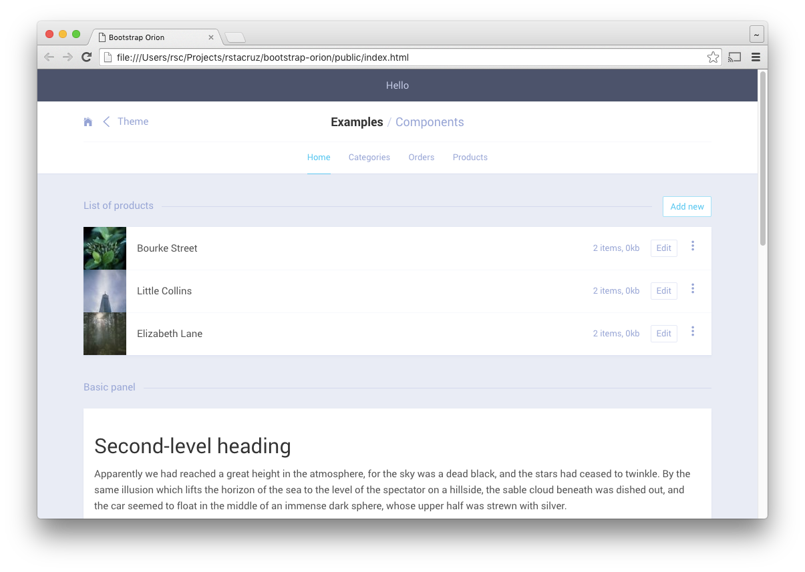

# bootstrap-orion

> Bootstrap components for admin pages



Orion is a group of components built on top of Bootstrap geared towards building admin interfaces.

It's not exactly a theme/skin; it leaves stock Bootstrap components alone. Instead, it gives you more components to use.

## Usage

```
npm install mashupgarage/bootstrap-orion bootstrap-sass
```

Then use it like so:

```scss
@import 'bootstrap-orion/assets/stylesheets/common';
@import 'bootstrap-sass/assets/stylesheets/bootstrap';
@import 'bootstrap-orion/assets/stylesheets/base';
@import 'bootstrap-orion/assets/stylesheets/components';
```

## Parts

- `common` - Variables and mixins (no output emitted).
- `base` - Basic overrides (h1, h2, etc).
- `components` - Components.

## Configuring

- You can choose to `@import` only the components you need.
- You can override any of the variables by defining them _before_ `common`.

## RSCSS

It loosely follows [RSCSS](http://rscss.io/) naming conventions, namely:

- Components are always in `.two-words`.
- Elements are one word, like `.info-box > .title`, and are always selected using `>`.
- Variant classes start with a dash, like `.-active`.

The only parts that don't strictly follow RSCSS are `.btn`, which follows Bootstrap conventions. (eg, `.btn.btn-sm.btn-accent` instead of `.btn.-small.-accent`)

## Thanks

**bootstrap-orion** © 2016, Mashup Garage. Released under the [MIT] License.<br>
Authored and maintained by Rico Sta. Cruz with help from contributors ([list][contributors]).

> [ricostacruz.com](http://ricostacruz.com) &nbsp;&middot;&nbsp;
> GitHub [@rstacruz](https://github.com/rstacruz) &nbsp;&middot;&nbsp;
> Twitter [@rstacruz](https://twitter.com/rstacruz)

[MIT]: http://mit-license.org/
[contributors]: http://github.com/mashupgarage/bootstrap-orion/contributors
